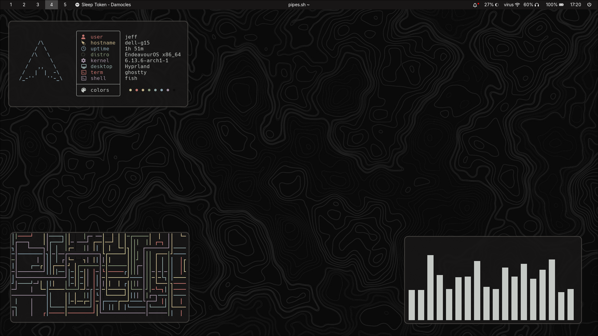
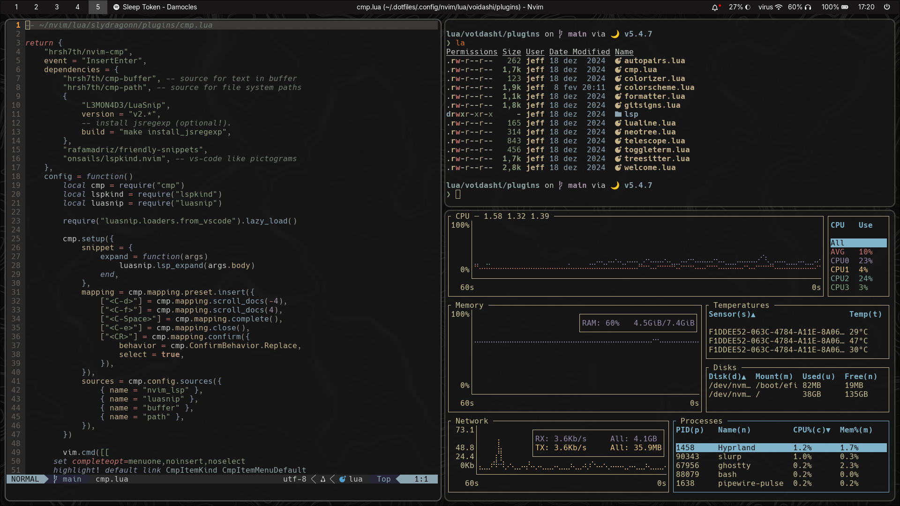

# 🖥️ Zen Linux Dotfiles

*A curated collection of minimal, performant, and aesthetic Linux configurations*

[](https://www.linux.org/)
[](https://archlinux.org/)
[](LICENSE)




## 📦 Features

### **Core Components**
- Window Managers: Hyprland + Sway (Wayland)
- Terminals: Ghostty • Alacritty • Kitty • Foot
- Shell: Fish with Starship prompt
- Editor: Neovim
- System: Bottom • Dunst • Waybar • Wofi

### **Key Configurations**
- Unified theming (Kanagawa Dragon)
- Performance-optimized WM rules
- Battery-friendly power management
- Context-aware workspace layouts
- Seamless clipboard integration

### **Automation Tools**
- `backup-configs.sh` - Smart config synchronization
- `install-packages.sh` - Cross-distro package installer
- 1-click restore for new installations

## 🚀 Installation

### Quick Start (For Brave Souls)
```bash
git clone https://github.com/voidashi/.dotfiles.git ~/.dotfiles
cd ~/.dotfiles

# Install packages
./scripts/install-packages.sh install

# Install configs
./scripts/backup-configs.sh install
```

**Note:** Review config files before running install scripts!

## 🗂️ Structure
```
.
├── .config/               # Main config directory
│   ├── hypr/            # Hyprland window manager
│   ├── nvim/            # Neovim IDE setup
│   ├── fish/            # Fish shell configuration
│   └── ...              # Other app configs
├── scripts/              # Maintenance utilities
├── wallpapers/           # Curated desktop backgrounds
...
```

## 🔧 Customization
1. Edit `scripts/config_files.conf` to select tracked configurations
2. Modify `scripts/packages.conf` to add/remove applications

## 🤝 Contributing
Found a bug? Have an improvement?  
- Open an issue for feature requests
- Submit PRs for well-documented fixes
- Share your modified configs in Discussions

## 📜 License
MIT Licensed - See [LICENSE](LICENSE) for details

---

*Inspired by the Linux ricing community • Built with ❤️ and too much coffee*
