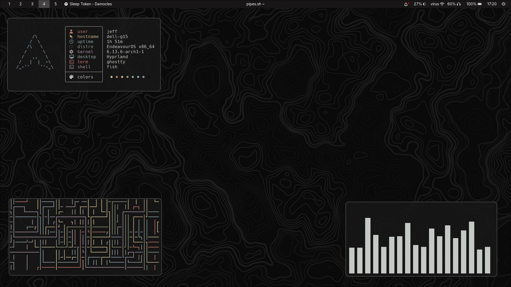
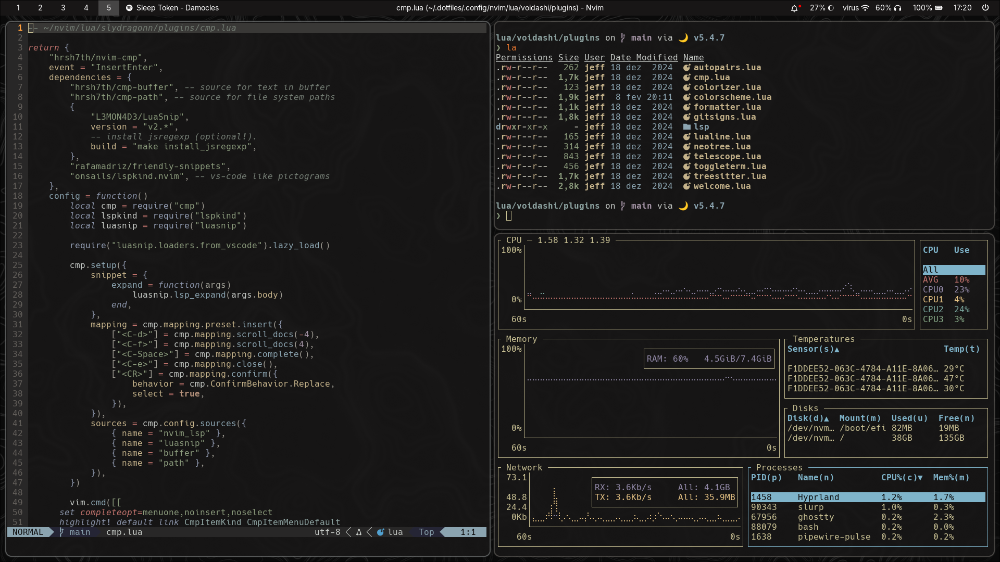

# Voidashi dotfiles

A dark, warm-charcoal Wayland desktop for Arch Linux, themed end to end from a single
file.

[](https://archlinux.org/)
[](https://wayland.freedesktop.org/)
[](LICENSE)




*The screenshots predate the current theme and are due to be retaken.*

## What this is

A whole desktop rather than a theme dropped on top of one. Compositor, bar, launcher,
notifications, lock screen, terminals, shell and editor, built to look like they were
decided together instead of collected. Hyprland is what it was built on, and Sway is the
fallback, themed to match.

Nothing here is a framework or a wrapper. Every piece is an ordinary config file in its
ordinary place, written in the format that program itself reads, which is what makes
this worth reading rather than only installing. It also means you do not have to take
all of it: lift the terminal colours, or the bar, or just the palette generator, and
ignore the rest.

## What is in it

| Piece | Program | Notes |
|---|---|---|
| Login | greetd + tuigreet | Suggested, not required. Any display manager finds both sessions |
| Compositor | Hyprland | Native Lua config, entry point `.config/hypr/hyprland.lua` |
| Compositor | Sway | The fallback, themed to match |
| Bar | Waybar | One description of the bar, shared by both compositors |
| Launcher | wofi | |
| Notifications | swaync | |
| Lock screen | swaylock | |
| Power menu | wlogout | |
| Clipboard | cliphist | History on `Super`+`Shift`+`V` |
| Idle | hypridle, swayidle | Lock at 15 min, screen off at 16, suspend at 30 |
| Terminals | Kitty, Ghostty, Alacritty, Foot | Identical palette, font and padding in all four |
| Shell | fish + starship | |
| Editor | Neovim | lazy.nvim, with a colorscheme written for this palette rather than a plugin |
| File managers | Dolphin, yazi | Graphical and terminal |
| System monitor | bottom | |
| Fetch | fastfetch, catnap | |
| Wallpaper | swaybg | A random image from your own directory |
| Applications | GTK 3, GTK 4, Qt and KDE | Themed by overriding the colours each toolkit already paints from |

## The one idea worth stealing

Every colour starts in **one file**: `scripts/theme/palette.json`. A generator renders it
into the format each program natively reads, and a checker proves the generated files
still match it.

```bash
$EDITOR scripts/theme/palette.json          # change a colour
python3 scripts/theme/generate_theme.py     # push it into every app's own format
python3 scripts/theme/check_palette.py      # check the generated files for drift
```

Change one hex and the terminals, the bar, the launcher, Neovim, GTK applications and
KDE applications all move together. The generator is plain Python with no dependencies,
and the files it writes whole carry a `GENERATED` header, which the checker fails on if
you edit one by hand.

Where colour mixes with structural config the file is hand-written instead and carries
its hex directly, swaylock, Sway and the fetches among them, so those do not follow on
their own. `check_palette.py` lists which, and closing the gap is tracked in
[`docs/TODO.md`](docs/TODO.md).

The design identity behind the palette is called Voidashi, and it is documented in
[`docs/design/`](docs/design/).

## Install

```bash
git clone https://github.com/voidashi/.dotfiles.git ~/.dotfiles
cd ~/.dotfiles

./scripts/install-packages.sh preview    # list the configured packages, install nothing
./scripts/install-packages.sh install    # install them
./scripts/backup-configs.sh install      # symlink the configs into $HOME
./scripts/backup-configs.sh check        # confirm every link landed
```

The install step needs `sudo`, and an AUR helper is recommended: a few of the packages
are AUR-only, and `paru`, `yay` or `pikaur` is used if one is present.

That installs and links everything, including the fonts in `fonts/`. It does not give you a way to *reach* the desktop:
nothing here enables a graphical login. If you already run a display manager it will
list Hyprland and Sway on the next boot and you can log out and back in. If you do not,
[`docs/SETUP.md`](docs/SETUP.md) step 6 sets up `greetd`, and `Hyprland` typed at a text
console works too.

> [!WARNING]
> `backup-configs.sh install` is the safe direction: it refuses to overwrite a real file
> unless you pass `--force`, and backs up anything it replaces. Its sibling `add` runs the
> other direction and **moves files out of `$HOME`** into the repo. You want `install`.
>
> Add `--dry-run` and the script prints every path it would touch, changing nothing:
>
> ```bash
> ./scripts/backup-configs.sh install --dry-run
> ```
>
> Changed your mind afterwards? `./scripts/backup-configs.sh uninstall` removes the
> symlinks and leaves your own files and the repo alone. `docs/SETUP.md` has the
> details, including where `--force` put your originals.

> [!IMPORTANT]
> **Clone to `~/.dotfiles` exactly.** Five tracked files reference that path absolutely,
> so another location silently breaks the wallpaper, the clipboard picker, the bar's power
> button and Neovim's dashboard. Three more things need a look before this feels right on
> your machine: the monitor layout in `.config/hypr/conf/monitors.lua` names specific
> outputs, the bar carries laptop-only modules, and if you already run KDE, the install
> links `kdeglobals` and `kcminputrc`, which is where Plasma applications read their
> palette and cursor, so your existing session is rethemed too. And if you want the themed
> prompt, fish has to become your login shell; nothing does that for you.
> [`docs/SETUP.md`](docs/SETUP.md) covers each of these.

### Taking only part of it

The package installer accepts names, so you can bring in only what you want:

```bash
./scripts/install-packages.sh install kitty fish starship
```

`backup-configs.sh install` has no equivalent: it is every path in `config_files.conf`,
plus the fonts, or none. For a subset, copy the directories you want out of `.config/`
yourself. Copy the whole directory rather than a single file, since a config often
includes a sibling, and expect to edit the Hyprland, Sway, Waybar and Neovim ones, which
name `~/.dotfiles` by absolute path.

Copying a terminal that way gets you the colours but not the typeface, since all four
ask for Iosevka Extended and no package provides it. The setup guide has the font step.

**[Full setup guide](docs/SETUP.md)** covers the long-form install, what to change for
your hardware, the Iosevka font you have to fetch yourself, and what to do when
something does not work.

## Keybindings

The entry points under Hyprland, with `Super` as the modifier. The full set is in
`.config/hypr/conf/binds.lua`, which is readable Lua rather than a config dialect.

| Keys | Action |
|---|---|
| `Super` + `Return` | Terminal |
| `Super` + `R` | Launcher |
| `Super` + `E` | File manager, add `Shift` for yazi in a terminal |
| `Super` + `Q` | Close window, add `Shift` to kill it |
| `Super` + `F` | Fullscreen, `Super` + `V` to toggle floating |
| `Super` + `Shift` + `V` | Clipboard history |
| `Super` + `1`…`9`, `0` | Switch workspace, ten of them, add `Shift` to move the window there |
| `Print` | Screenshot the output, `Shift` for a region, `Super` for the window |
| `Super` + `M` | Exit the compositor |

The power menu opens from the bar's power button. Closing the lid suspends the machine
and the screen locks on the way down, which comes from logind and `hypridle` rather than
from a binding here.

Sway's bindings are in `.config/sway/config` and are close but not identical: its
launcher is on `$mod` + `D`.

## Repository layout

```
.config/                  the tracked configs, symlinked into place path by path
docs/                     everything written down, see docs/README.md
fonts/                    three of the four faces; Iosevka you fetch yourself
scripts/
  backup-configs.sh       install, uninstall and audit the tracked dotfiles
  install-packages.sh     installs the packages listed in packages.conf
  verify.sh               runs every validator and prints what each returned
  tests/                  sandboxed tests for backup-configs.sh
  theme/                  palette.json, the generator and the checker
  wm/                     helpers the compositors call while running
wallpapers/               one sample image, so a fresh clone has something to show
```

## Documentation

[`docs/README.md`](docs/README.md) indexes everything and says who each document is
for. The three that matter most:

- **[`docs/SETUP.md`](docs/SETUP.md)** to install it and make it yours.
- **[`docs/design/RICE-GUIDE.md`](docs/design/RICE-GUIDE.md)** for the palette, the
  ANSI table, and the rules about how colour gets used.
- **[`docs/TODO.md`](docs/TODO.md)** for what is open, including the rough edges this
  desktop still has, and what is parked with the explanations already ruled out.
  Decisions already taken live in
  [`docs/TURNING-POINTS.md`](docs/TURNING-POINTS.md) instead.

## Contributing

Issues and pull requests are welcome. This is a personal configuration rather than a
framework, so the most useful contributions are bug reports, portability fixes, and
telling me something is broken on a machine that is not mine.

## License

MIT. See [LICENSE](LICENSE).
